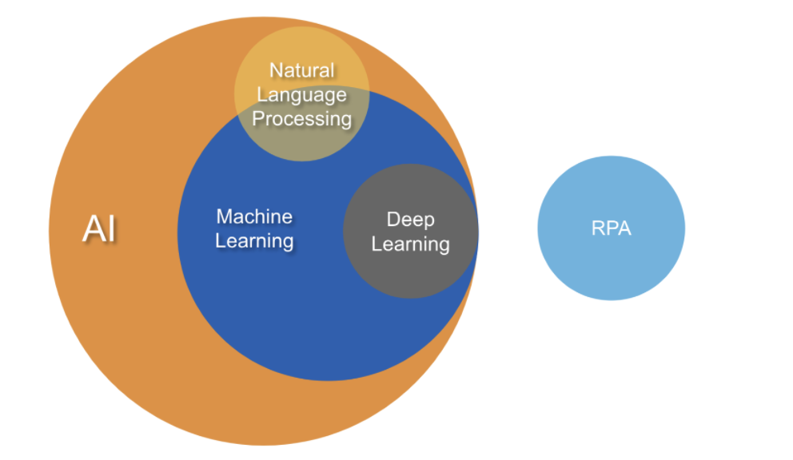

It is important to start with some definitions of the terminology used in this toolkit.

**Data science** is broadly defined as a craft or set of activities that involves working with large amounts of data, grappling with computational problems introduced by structure, size, messiness such as missing data, and the complexity of data, while attempting to solve a real-world problem. Product-oriented data science deals with everything from the data engineering and infrastructure for data collection and logging, to privacy considerations, to decisions around what data is user-facing, how and which data will be used to inform decisions, and how the data will be built back into the product.1 

**Artificial intelligence** (AI) is broadly defined as an effort to automate intellectual tasks normally performed by human beings. AI includes machine learning and deep learning as well as approaches that do not involve any learning. Symbolic AI, for example, is premised on the ability of programmers to hard code a sufficiently large number of rules for manipulating knowledge (this is also known as *expert systems*). Symbolic AI can serve well for logical, well-defined problems.2  

**Machine learning** (ML) is better suited for more complex and intractable problems, such as image classification, speech recognition, language translation and probabilistic anomaly detection. Machine learning is a subset of AI where data can be used to train computers to detect patterns and mimic human decision-making. A machine-learning system is trained rather than explicitly programmed. It’s presented with many examples relevant to a task, and it finds statistical structure in these examples that eventually allows the system to come up with rules for automating the task. Machine learning involves using algorithms to detect patterns in data and then use those learned patterns to predict an outcome on new data. Generally, this involves an iterative process and allows the machine learning system to determine predictions without being explicitly programmed.

**Deep learning** is a subset of ML that can process a wider range of data resources including text, images and audio clips and typically requires less data preprocessing by humans. The “deep” part refers to learning successive layers of increasingly meaningful representations all learned from training data. The depth refers to the number of layers that contribute to a model of the data.  In contrast, other approaches to machine learning tend to focus on learning only one or two layers of representations of the data; hence, they’re sometimes called shallow learning. In common-speak, the application of neural networks models refers to deep learning.

**Natural Language Processing** (NLP) heavily leverages Machine Learning as well as Deep Learning to allow computers to interact with humans in their own natural language whether written or oral. NLP applications attempt to understand natural human communication, either written or spoken, and communicate in return with us using similar, natural language.

**Robotic Process Automation** (RPA) is a type of automation that mimics the activity of a human when they carry out a structured, repetitive task or process, little judgement. It is generally rule based, can’t learn outside parameters, so not considered AI; however, RPA can be built with learning modules on complex tasks.

Figure 1 diagram below depicts the AI ecosystem and the relationship between AI, ML, Deep Learning, NLP and RPA.

**Footnotes**

1 Schutt, Rachel, and Cathy O'Neil. *Doing Data Science: Straight Talk from the Frontline.* O'Reilly, 2013.

2 Chollet François. *Deep Learning with Python.* Manning Publications, 2021.
