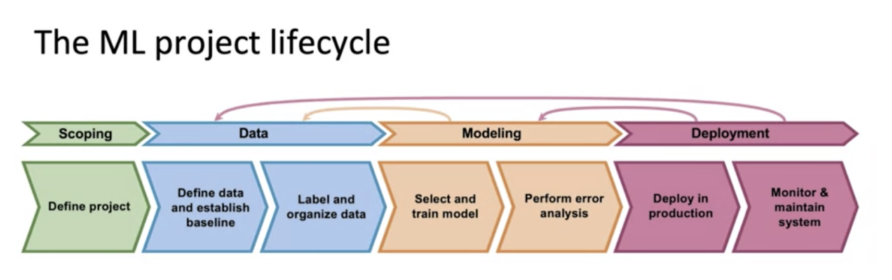

This toolkit will emphasize the key aspects of the machine learning project lifecycle. This starts with scoping (defining the project), data collection and organization, model development and model deployment. 

**Figure 2. The Machine Learning Lifecycle**  

Machine learning projects typically start with **scoping** or defining the project. This includes deciding on the objectives of the project and what makes it a good candidate for a machine learning application.  

Then, it is defining the **data** and establishing a baseline. For example, if we can accurately predict an outcome 50% of the time just by flipping a coin, a model should, at least, do better than that. Features should be engineered attuned to the underlying characteristics of the data (for instance, different treatment of categorical versus numerical data types) and business-specific features related to the defined problem. Often, data exploration and data mining inform the data scientist about the features to craft. Moreover, we should ensure the data is labeled consistently in the case of a supervised learning problem.  

The **modeling process** involves selecting an algorithm or model framework (what algorithmic framework makes sense for the problem and data at hand) and training the model to learn the representations in the input data that get us closer to the output data. Error analysis is performed to evaluate and improve the model. Typically, the model that best minimizes the error is selected for deployment. Often, modeling informs us about issues in the data organization and labeling, leading us to go back and fix issues in the data.  

**Deployment** is typically the final step in the process. Once the model is selected, and it is put into production, it should be continually monitored through error analysis and the entire system should be maintained to detect any changes in the underlying data distribution serving as inputs to the model. Over time, it is common for machine learning models to require maintenance and retraining (reverting back to model development and then re-deployed). 

**Attribution**

Ng, Andrew & Cristian Bartolomé Arámburu (n.d.). Introduction to Machine Learning in Production [MOOC]. Coursera DeepLearning.AI. <u>https://www.coursera.org/learn/introduction-to-machine-learning-in-production</u> 
